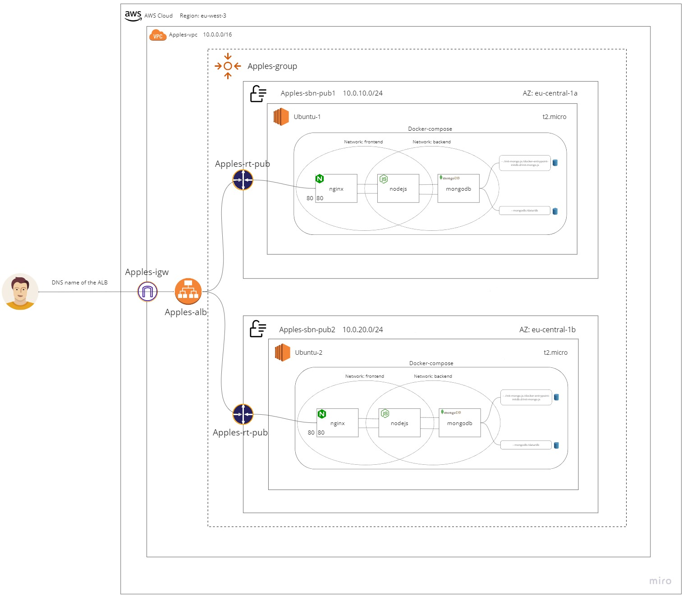

# Apples-Project David Davidov
Tools used in the project: Cloud - VMWare
1. Development: node js
2. Containerization: Docker
3. Source Code Managment: GitHub
4. DataBase: Mongo
5. Scripting: Bash
6. Operating System: Linux Ubuntu

Apples Project runs a website that display "Hello World!" and shows the number of apples stored in a database.

## Running the Server Step by Step:
1. Clone the repository from GitHub.
2. Run the command ' bash ./install-docker.sh '. This script will install docker and docker-compose for building and running the environment.
3. Then run the command ' bash start.sh '. This script will initiate the process of building and running the environment.

Once the architecture is up and running, you can access the website at the following URL: http://paste-here-your-pc-ip:80

## Apples-Project Topology

### How it works?
 
The Apples project uses Docker Compose to run three containers (nginx, nodejs, and mongodb) in two networks (frontend and backend) to provide better security for the database.

When a user visits the site, a request is made through port 80, which passes through nginx. With the help of a reverse proxy, nginx forwards the request to nodejs, which then searches for the relevant data in the database.

Overall, the project demonstrates a simple web application architecture using Docker containers and showcases the interaction between different services.
